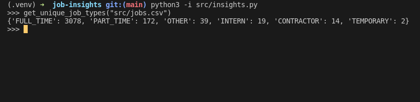

# Boas vindas ao repositório do projeto Job Insights

Esse projeto foi desenvolvido como projeto avaliativo no módulo de Ciência da Computação, no curso de Desenvolvimento Web da [Trybe](https://www.betrybe.com/?utm_medium=cpc&utm_source=google&utm_campaign=Brand&utm_content=ad03_din_h), o objetivo desse projeto foi colocar em pratica meus conhecimentos em testes com Pytest, manipulação de arquivos, tratamento de exceções, escrever meus próprios módulos e importá-los em outros códigos.

---

## Preview do projeto

## Sumário

- [Boas vindas ao repositório do projeto Task Organizer!](#boas-vindas-ao-repositório-do-projeto-task-organizer)
- [Estrutura de diretórios e arquivos](#Estrutura-de-diretórios-e-arquivos)
- [Desenvolvimento](#Desenvolvimento)
- [Instalação do projeto localmente](#Instalação-do-projeto-localmente)
- [Funções do projeto](#Funções-do-projeto)
  - [read](#read)
  - [get_unique_job_types](#get_unique_job_types)
  - [get_unique_industries](#get_unique_industries)
  - [get_max_salary](#get_max_salary)
  - [get_min_salary](#get_min_salary)
  - [filter_by_job_type](#filter_by_job_type)
  - [filter_by_industry](#filter_by_industry)
  - [matches_salary_range](#matches_salary_range)
  - [filter_by_salary_range](#filter_by_salary_range)
  - [sort_by](#sort_by)
  - [Implementando a página de um job](#Implementando-a-página-de-um-job)
- [Link para o portfolio](#Link-para-o-portfolio)

---

### Estrutura de diretórios e arquivos

~~~bash
.
├── README.md
├── dev-requirements.txt
├── feedback.jsonc
├── requirements.txt
├── src
│   ├── app.py
│   ├── insights.py
│   ├── jobs.csv
│   ├── jobs.py
│   ├── more_insights.py
│   ├── routes_and_views.py
│   ├── sorting.py
│   └── templates
│       ├── base.jinja2
│       ├── includes
│       │   └── nav.jinja2
│       ├── index.jinja2
│       ├── job.jinja2
│       └── list_jobs.jinja2
├── tests
│   ├── __init__.py
│   ├── mocks
│   │   ├── job_1.html
│   │   ├── jobs.csv
│   │   ├── jobs_with_industries.csv
│   │   ├── jobs_with_salaries.csv
│   │   └── jobs_with_types.csv
│   ├── sorting
│   │   ├── conftest.py
│   │   ├── mocks.py
│   │   └── test_sorting.py
│   ├── test_feedback.py
│   ├── test_flask_app.py
│   ├── test_insights.py
│   ├── test_jobs.py
│   ├── test_more_insights.py
│   └── test_routes_and_views.py
~~~

[Voltar ao sumário](#Sumário)

---

## Desenvolvimento

Este projeto foi desenvolvido utilizando Python.

Neste projeto foram implementadas análises a partir de um conjunto de dados sobre empregos. As implementações foram incorporadas a um aplicativo Web desenvolvido com Flask (um framework web muito popular na comunidade Python). Também foram escritos testes para a implementação de uma análise de dados.

Os dados foram extraídos do site [Glassdoor](https://www.glassdoor.com.br/) e obtidos através do [Kaggle](https://www.kaggle.com/atharvap329/glassdoor-data-science-job-data), uma plataforma disponiblizando conjuntos de dados para cientistas de dados.

[Voltar ao sumário](#Sumário)

---

## Instalação do projeto localmente

Após cada um dos passos, haverá um exemplo do comando a ser digitado para fazer o que está sendo pedido, caso tenha dificuldades e o exemplo não seja suficiente, não hesite em me contatar em *iago.pferreiravr@gmail.com*.

Passo 1. Abra o terminal e crie um duretório no local de sua preferência com o comando `mkdir`:

~~~bash
mkdir projetos-iago
~~~

Passo 2. Entre no diretório que você acabou de criar:

~~~bash
cd projetos-iago
~~~

Passo 3. Clone o projeto:

~~~bash
git clone git@github.com:IagoPFerreira/job-insights.git
~~~

Passo 4. Após terminado a clonagem, entre no diretório que você acabou de clonar:

~~~bash
cd job-insights
~~~

Passo 5. Crie o ambiente virtual para rodar o projeto

~~~bash
python3 -m venv .venv && source .venv/bin/activate
~~~

Passo 6. Instale todas as dependências do projeto

~~~bash
python3 -m pip install -r dev-requirements.txt
~~~

⚠️ **Atenção** ⚠️

Essa aplicação foi desenvolvida utilizando Python 3, é necessário para o funcionamento correto desse projeto que o Python esteja instalado na sua máquina, caso você não o tenha instalado, você pode fazer o download do Python direto da [documentação do Python](https://www.python.org/downloads/).

---

✍️ **Teste manual**: abra um terminal Python importando as funções de interesse através do comando `python3 -i src/arquivo_de_interesse.py` e as invoque utilizando diferentes parâmetros.

[Voltar ao sumário](#Sumário)

---

## Funções do projeto

### read

local: `src/jobs.py`

Para começarmos a processar os dados, devemos antes carregá-los em nossa aplicação. Esta função é responsável por abrir o arquivo CSV e retornar os dados no formato de uma lista de dicionários.

- A função deve receber um *path* (uma string com o caminho para um arquivo).
- A função abre o arquivo e lê seus conteúdos.
- A função trata o arquivo como CSV.
- A função retorna uma lista de dicionários, onde as chaves são os cabeçalhos de cada coluna e os valores correspondem a cada linha.

✍️ Teste manual: abra um terminal Python importando estas funções através do comando `python3 -i src/jobs.py` e invoque a função utilizando diferentes *paths*.

[Voltar ao sumário](#Sumário)

---

### 2 - get_unique_job_types

local: `src/insights.py`

Essa função identifica quais tipos de empregos existem.

- A função deve receber o *path* do arquivo csv com os dados.
- A função invoca a função `jobs.read` com o *path* recebido para obter os dados.
- A função retorna uma lista de valores únicos presentes na coluna `job_type`.

[Voltar ao sumário](#Sumário)

---

### get_unique_industries

local: `src/insights.py`

Essa função identifica quais indústrias estão representadas no conjunto de dados fornecidos.

- A função deve receber o *path* do arquivo csv com os dados.
- A função invoca a função `jobs.read` com o *path* recebido para obter os dados.
- A função retorna uma lista de valores únicos presentes na coluna `industry`.
- A função desconsidera valores vazios.

[Voltar ao sumário](#Sumário)

---

### get_max_salary

local: `src/insights.py`

Os dados apresentam faixas salariais para cada emprego exibido. Essa função encontra o maior valor de todas as faixas.

- A função deve receber o *path* do arquivo csv com os dados.
- A função invoca a função `jobs.read` com o *path* recebido para obter os dados.
- A função ignora os valores ausentes.
- A função retorna *um valor inteiro* com o maior salário presente na coluna `max_salary`.

[Voltar ao sumário](#Sumário)

---

### get_min_salary

local: `src/insights.py`

Os dados apresentam faixas salariais para cada emprego exibido. Essa função encontra o maior valor de todas as faixas.

- A função deve receber o *path* do arquivo csv com os dados.
- A função invoca a função `jobs.read` com o *path* recebido para obter os dados.
- A função deve ignorar os valores ausentes.
- A função deve retornar *um valor inteiro* com o menor salário presente na coluna `min_salary`.

[Voltar ao sumário](#Sumário)

---

### filter_by_job_type

local: `src/insights.py`

Os empregos estão listados em um aplicativo web. Para permitir que a pessoa usuária possa filtrar os empregos por tipo de emprego, essa função implementa esse filtro.

- A função deve receber uma lista de dicionários `jobs` como primeiro parâmetro.
- A função deve receber uma string `job_type` como segundo parâmetro.
- A função retorna uma lista com todos os empregos onde a coluna `job_type` corresponde ao parâmetro `job_type`.

[Voltar ao sumário](#Sumário)

---

### filter_by_industry

local: `src/insights.py`

Do mesmo modo, o aplicativo precisa permitir uma filtragem por indústria. Essa função implementa esse filtro.

- A função deve receber uma lista de dicionários `jobs` como primeiro parâmetro.
- A função deve receber uma string `industry` como segundo parâmetro.
- A função retorna uma lista de dicionários com todos os empregos onde a coluna `industry` corresponde ao parâmetro `industry`.

[Voltar ao sumário](#Sumário)

---

### matches_salary_range

local: `src/insights.py`

O aplicativo vai precisar filtrar os empregos por salário. Como uma função auxiliar, foi implementada a `matches_salary_range` para conferir que o salário procurado está dentro da faixa salarial daquele emprego. Ela também confere se a faixa salarial faz sentido -- isto é, se o valor mínimo é menor que o valor máximo.

- A função deve receber um dicionário `job` como primeiro parâmetro, com as chaves `min_salary` e `max_salary`.
- A função deve receber um inteiro `salary` como segundo parâmetro.
- A função lança um erro `ValueError` nos seguintes casos:
  - alguma das chaves `min_salary` ou `max_salary` estão *ausentes* no dicionário;
  - alguma das chaves `min_salary` ou `max_salary` tem valores não-numéricos;
  - o valor de `min_salary` é maior que o valor de `max_salary`;
  - o parâmetro `salary` tem valores não-numéricos;
- A função retorna `True` se o salário procurado estiver dentro da faixa salarial ou `False` se não estiver.

[Voltar ao sumário](#Sumário)

---

### filter_by_salary_range

local: `src/insights.py`

Essa função é a implementação do filtro propriamente dito. Para esta filtragem, usamos a função auxiliar `matches_salary_range` -- tomando o cuidado de descartar os empregos que apresentarem faixas salariais inválidas.

- A função deve receber uma lista de dicionários `jobs` como primeiro parâmetro.
- A função deve receber um inteiro `salary` como segundo parâmetro.
- A função ignora os empregos com valores inválidos para `min_salary` ou `max_salary`.
- A função retorna uma lista com todos os empregos onde o salário `salary` estiver entre os valores da coluna `min_salary` e `max_salary`.

[Voltar ao sumário](#Sumário)

---

### sort_by

local: `src/test_sorting.py`

Esta função permite que a pessoa usuária escolhe por qual critério de ordenação ela deseja, para exibir os empregos.

- A função `sort_by` deve receber dois parâmetros:
  - `jobs` uma lista de dicionários com os detalhes de cada emprego;
  - `criteria` uma string com uma chave para ser usada como critério de ordenação.
- O parâmetro `criteria` deve ter um destes valores: `min_salary`, `max_salary`, `date_posted`
- A ordenação para `min_salary` deve ser crescente, mas para `max_salary` ou `date_posted` devem ser decrescentes.
- Os empregos que não apresentarem um valor válido no campo escolhido para ordenação devem aparecer no final da lista.

> 📌 O **teste da Trybe** espera que a **implementação** falhe em alguns casos. Nesse caso, o teste terá a saída `XFAIL` (ao invés de `PASS` ou `FAIL`), e isso significa que o requisito foi atendido ✔️

[Voltar ao sumário](#Sumário)

---

### Implementando a página de um job

local: `src/routes_and_views.py`

Para fechar foi feita uma implementação de uma página usando o Flask, baseado somente nas páginas, `index` e `jobs`, que já haviam sido fornecidas prontas pela Trybe,  e tentar criar uma página que irá exibir todas as informações de um job em específico.

- A função é decorada com a rota `/job/<index>`.
- A função deve receber um parâmetro `index`.
- A função chama a `read` para ter uma lista com todos os jobs.
- A função chama a `get_job`, declarada no arquivo `src/more_insights.py`, para selecionar um job específico pelo `index`.
- A função renderiza o template `job.jinja2`, passando um parâmetro `job` contendo o job retornado pela `get_job`.

[Voltar ao sumário](#Sumário)

---

⚠️ **Este projeto ainda possui espaço para melhorias e novas implementações, ambas serão feitas com o tempo, caso você tenha alguma sugestão, envie-a para mim no meu e-mail *iago.pferreiravr@gmail.com*** ⚠️

---

## Link para o portfolio

Você pode ir ao meu portfolio e conferir os outros projetos que eu já desenvolvi

<https://iagopferreira.github.io/portfolio-react>
